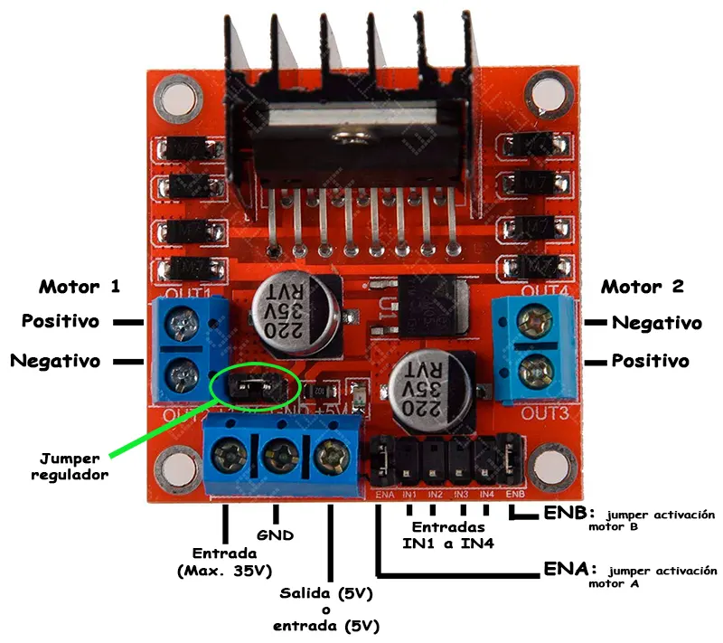

<center>
<figure>

<figcaption>Control motor L298N</figcaption>
</figure>
</center>

El módulo L298N es un controlador de motores de doble puente H que tiene por función regular la velocidad y dirección de giro de hasta dos motores de corriente continua (DC) o un motor paso a paso. Soporta corrientes de hasta 2A por canal y voltajes de operación de entre 5V y 35V. 


### Conexiones Principales
Organiza el cableado del **L298N** siguiendo esta distribución de pines:

* VCC: Entrada de voltaje para los motores (7V a 35V).
* GND: Tierra común. Debe conectarse obligatoriamente a la tierra del microcontrolador (ej. Arduino).
* 5V: Salida de 5V si el jumper de regulación está puesto (sirve para alimentar el Arduino). Entrada de 5V si el jumper está quitado.
* OUT1 y OUT2: Bornes de conexión para el Motor A.
* OUT3 y OUT4: Bornes de conexión para el Motor B.
* ENA: Pin de habilitación y control de velocidad para el Motor A (usa PWM).
* IN1 e IN2: Pines de control de dirección para el Motor A.
* IN3 e IN4: Pines de control de dirección para el Motor B.
* ENB: Pin de habilitación y control de velocidad para el Motor B (usa PWM). 

------------------------------
### Lógica de Control de Dirección
La dirección de los motores se determina enviando señales lógicas (Altas/LOW) a los pines IN. 

| IN1 / IN3 | IN2 / IN4 | Efecto en el Motor |
|---|---|---|
| HIGH | LOW | Giro en sentido horario |
| LOW | HIGH | Giro en sentido antihorario |
| LOW | LOW | Motor detenido (freno suave) |
| HIGH | HIGH | Motor detenido (freno rápido) |

------------------------------
### Código de Ejemplo (Arduino)
Este script de ejemplo hace girar el Motor A hacia adelante variando su velocidad, luego frena, y finalmente cambia el sentido de giro.

```cpp showLineNumbers
// Pines de control para el Motor A
const int pinENA = 9;  // Debe ser un pin PWM
const int pinIN1 = 8;
const int pinIN2 = 7;

void setup() {
  pinMode(pinENA, OUTPUT);
  pinMode(pinIN1, OUTPUT);
  pinMode(pinIN2, OUTPUT);
}
void loop() {
  // 1. Girar hacia adelante a velocidad máxima
  digitalWrite(pinIN1, HIGH);
  digitalWrite(pinIN2, LOW);
  analogWrite(pinENA, 255); // Rango de 0 a 255
  delay(3000);

  // 2. Desacelerar gradualmente
  for (int velocidad = 255; velocidad >= 0; velocidad--) {
    analogWrite(pinENA, velocidad);
    delay(10);
  }
  delay(1000);

  // 3. Girar en sentido contrario a velocidad media
  digitalWrite(pinIN1, LOW);
  digitalWrite(pinIN2, HIGH);
  analogWrite(pinENA, 150);
  delay(3000);

  // 4. Detener el motor
  digitalWrite(pinIN1, LOW);
  digitalWrite(pinIN2, LOW);
  delay(2000);
}
```

### Consideraciones Críticas

* Jumper de 5V: Si el voltaje en VCC supera los 12V, debes retirar el jumper negro de 5V para evitar dañar el regulador integrado. En ese caso, deberás alimentar la lógica del módulo con una fuente externa de 5V.
* Tierra Común: El error más frecuente es olvidar conectar el pin GND del L298N al pin GND del Arduino. Sin esta unión de tierras, los motores no responderán de forma estable.
* Caída de Voltaje: El chip L298N tiene transistores bipolares internos que provocan una pérdida de voltaje de aproximadamente 1.5V a 2V entre la entrada VCC y la salida del motor. Asegúrate de que tu fuente compense esa pérdida.


### Referencias


- [https://cursos.mcielectronics.cl](https://cursos.mcielectronics.cl/2023/01/05/interfaz-driver-modulo-l298n-motor-dc-con-arduino/)
- [https://sites.google.com](https://sites.google.com/a/iesemilioprados.com/tecnologia/1-bach/lego/arduino/practicas/l298n)
- [https://www.arcaelectronica.com](https://www.arcaelectronica.com/blogs/tutoriales/driver-l298n-puente-h-motores-arduino)
- [https://www.ariat-tech.es](https://www.ariat-tech.es/blog/l298n-dc-motor-drive-module-features,pinout,usage-and-application.html)
