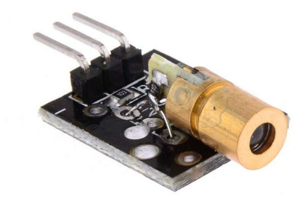

<center>
<figure>

<figcaption>Emisor láser HW-493.</figcaption>
</figure>
</center>

HW-493 (también conocido como KY-008) es un módulo emisor de luz láser rojo de 650 nm y 5V, diseñado para proyectos de electrónica y robótica con placas como Arduino. Emite un punto de luz enfocado de baja potencia (`<5 mW`) y cuenta con una pequeña placa con tres pines.

El KY-008 consta de un diodo láser rojo de 6 mm y 650 nm, una resistencia limitadora de corriente y tres pines de conexión de 2,54 mm en una placa de circuito impreso de 18,5 × 15 mm. 

:::danger[Atención]
Manéjelo con precaución: nunca apunte el haz directamente a los ojos ni a superficies reflectantes.

Este se calienta durante el funcionamento, por lo tanto, no use más corriente de la recomendada.
:::

En general se utiliza junto a un sensor de luz que capta la señal y su interrupción. El haz láser es visible incluso dentro de una habitación llena de humo y hasta 14 metros.

### Características:

- Tensión de funcionamiento: 5 V
- Consumo de corriente: 40 mA
- Potencia: 5 mW
- Longitud de onda: 650 nm
- Dimensiones: 18,5 x 15 mm


### Código

```cpp showLineNumbers
#define LASER 2 // conexión pin 'S'

void setup() {
  pinMode(LASER, OUTPUT);
}

void loop() {
  // parpadea el LED cinco veces
  for (byte i = 0; i <= 5; i++) {
     digitalWrite(LASER, HIGH);
     delay(500);
     digitalWrite(LASER, LOW);
     delay(500);
  }
  // pausa 3 segundos
  delay(3000);
}
```
### Referencias
- [Arduino Spain](https://sp.arduino-france.site/diodo-laser/)