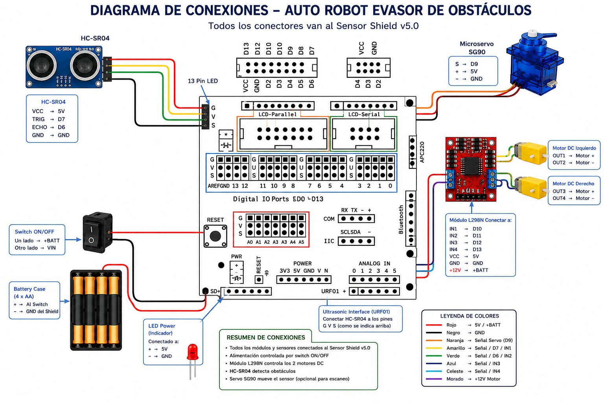
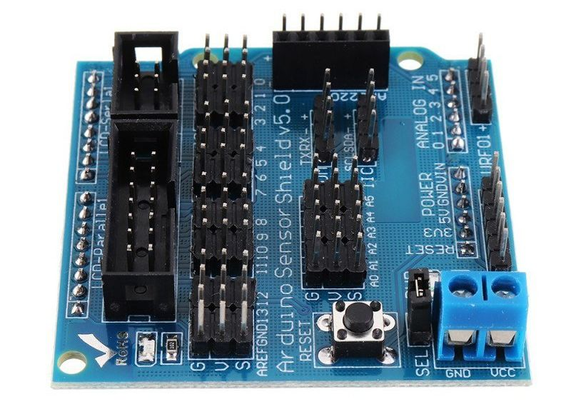
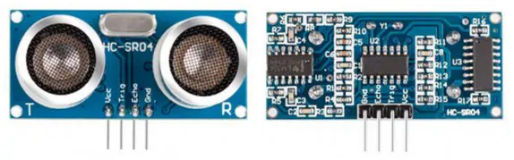

Este primer proyecto es un proyecto simple y muy publicitado en redes sociales y ampliamente difundido en Youtube. Consiste en que un auto detecte una ruta entre obtáculos basado en un sensor ultrasónico, y opcionalmente, apoyado por un servo motor que hace girar el sensor entre 0 y 180 grados de rotación.

Para conectar todos tus componentes, se usará el Arduino Uno como el cerebro central, el cual distribuirá la energía y las señales de control hacia el controlador de motores L298N, el sensor de distancia HC-SR04 y el microservo SG90.

El sensor HC-SR04 se monta físicamente sobre el eje del servo SG90 para permitirle girar y escanear el entorno. Como el L298N consumirá la energía principal de las baterías, usaremos su regulador integrado de 5V para alimentar de forma segura el Arduino, el servo y el sensor.

## **Cableado**


### Diagrama de Conexiones

Sigue esta guía pin por pin para realizar el cableado de tu circuito:

<center>
<figure>

<figcaption>Diagrama de conexion propuesto.</figcaption>
</figure>
</center>

**1. Alimentación Principal y Motores (L298N)**

* **Baterías (6V a 12V) \[Anodo / Positivo\]** ➡️ Pin **12V** del L298N  
* **Baterías \[Cátodo / Negativo\]** ➡️ Pin **GND** del L298N **y** pin **GND** del Arduino *(Tierra común)*  
* **Pin 5V del L298N** ➡️ Pin **5V** del Arduino *(Alimenta la placa)*  
* **Motor Derecho** ➡️ Bornes **OUT1** y **OUT2** del L298N  
* **Motor Izquierdo** ➡️ Bornes **OUT3** y **OUT4** del L298N \[[1](https://envistiamall.com/es/products/hc-sr04-ultrasonic-distance-measuring-transducer-sensor-module-for-arduino?srsltid=AfmBOoofkrQ-JCzf0qSA0_yCRSsd_06q7P2SoWzf-eZMVJmkw3n8GMIk)\]

**2. Control de Motores (Arduino ➡️ L298N)**

* **Pin Digital 1** (PWM) del Arduino ➡️ Pin **ENA** del L298N *(Velocidad Motor Derecho)*  
* **Pin Digital 2** del Arduino ➡️ Pin **IN1** del L298N *(Dirección Motor Derecho)*  
* **Pin Digital 3** del Arduino ➡️ Pin **IN2** del L298N *(Dirección Motor Derecho)*  
* **Pin Digital 4** del Arduino ➡️ Pin **IN3** del L298N *(Dirección Motor Izquierdo)*  
* **Pin Digital 5** del Arduino ➡️ Pin **IN4** del L298N *(Dirección Motor Izquierdo)*  
* **Pin Digital 6** (PWM) del Arduino ➡️ Pin **ENB** del L298N *(Velocidad Motor Izquierdo)*  
  *(Nota: Asegúrate de retirar los puentes/jumpers de plástico de ENA y ENB para poder conectar estos cables y controlar la velocidad).*

**3. Sensor Ultrasonido (Arduino ➡️ HC-SR04)**

* **Pin 5V** del Arduino ➡️ Pin **VCC** del HC-SR04  (amarillo)
* **Pin Digital 2** del Arduino ➡️ Pin **TRIG** del HC-SR04 (naranjo)
* **Pin Digital 3** del Arduino ➡️ Pin **ECHO** del HC-SR04  (rojo)
* **Pin GND** del Arduino ➡️ Pin **GND** del HC-SR04 

:::info[Referencias]
- [Como funciona el sensor](https://cursos.mcielectronics.cl/2022/12/06/como-funciona-el-sensor-ultrasonico-hc-sr04-y-como-se-conecta-con-arduino/), 
- [Modulos ultrasónicos](https://reversepcb.com/es/modulos-de-sensor-ultrasonico-hc-sr04/), 
- [Tutoriales de electronica](https://www.tecneu.com/blogs/tutoriales-de-electronica/adentrandonos-en-el-mundo-de-la-deteccion-ultrasonica-con-el-sensor-hc-sr04?srsltid=AfmBOopkgSIb38hiOXRbwquueHIgZ9pyWtNUmzTFkSIHXS9LE-1Pr8TZ)
:::

**4. Servomotor (Arduino ➡️ SG90)**

* **Pin 5V** del Arduino ➡️ Cable **Rojo** (VCC) del SG90  
* **Pin Digital 11** (PWM) del Arduino ➡️ Cable **Naranja/Amarillo** (Señal) del SG90  
* **Pin GND** del Arduino ➡️ Cable **Marrón/Negro** (GND) del SG90 

:::info[Referencias]
[Manual de servo motor SG90](https://m.media-amazon.com/images/I/71R6lx1GQEL.pdf?ref=dp_product_quick_view)
:::
---

#### 🛠️ Montaje Físico (Sensor sobre el Servo)

Para fijar el HC-SR04 sobre el SG90 y lograr el sistema de "radar", tienes tres opciones comunes:

1. **Soporte impreso en 3D:** Es la solución más limpia. Existen estructuras diseñadas específicamente para encajar el sensor y atornillarse directamente a las aspas plásticas del servo.  
2. **Cinta de doble cara acolchada:** Pega el reverso plano del sensor directamente sobre la cruceta plástica (hélice) del servo. Evita que los pines soldados del sensor toquen partes metálicas para prevenir cortocircuitos.  
3. **Pegamento caliente (Silicona):** Aplica una gota pequeña sobre el aspa del servo y une con cuidado la placa del HC-SR04.

---

### Uso del sensor shield v5.0

#### **📋 Diagrama de Cableado con Sensor Shield V5.0**

<center>
<figure>

<figcaption>Placa de expansión Sensor Shield v5.0.</figcaption>
</figure>
</center>

Para alimentar todo el conjunto usando el regulador del L298N de forma segura a través del Shield, realiza las siguientes conexiones:

**1\. Alimentación del Sistema (Borneras y Bloque Externo)**

* **Batería (6V-12V) \[Positivo\]** ➡️ Pin **12V** del L298N.  
* **Batería \[Negativo\]** ➡️ Pin **GND** del L298N.  
* **L298N Pin 5V** ➡️ Conéctalo directamente a la bornera azul de tornillos marcada como **VCC** (o entrada de energía externa) en el Sensor Shield V5.0. *(Esto alimenta al Shield y al Arduino desde abajo)*.  
* **L298N Pin GND** ➡️ Conéctalo a la bornera azul marcada como **GND** en el Sensor Shield V5.0 *(Tierra común obligatoria)*.

---
### Control de Motores (L298N)

Los motores de corriente continua (DC) requieren mucha más corriente para girar de la que un pin digital de Arduino puede suministrar de manera segura (el microcontrolador de Arduino está limitado a un máximo de **40 mA** por pin). Si conectáramos los motores directamente al Arduino, podríamos quemar la placa de forma irreversible. 

El **L298N** actúa como una etapa de potencia intermedia: recibe señales de control de baja corriente desde el Arduino y las traduce en un flujo de alta corriente proveniente de una fuente de alimentación externa (el paquete de baterías) hacia los motores. Además, al ser un **puente H**, nos permite alternar la polaridad del voltaje aplicado a los motores, permitiendo que estos giren hacia adelante o hacia atrás.

<center>
<figure>

<figcaption>Control de motores (dual) L298N</figcaption>
</figure>
</center>

Cada señal va directamente a la fila de pines **"S" (Señal)** del número digital correspondiente en el Shield:

* Pin **ENA** del L298N ➡️ Pin Digital **5** (Fila S).  
* Pin **IN1** del L298N ➡️ Pin Digital **2** (Fila S).  
* Pin **IN2** del L298N ➡️ Pin Digital **3** (Fila S).  
* Pin **IN3** del L298N ➡️ Pin Digital **4** (Fila S).  
* Pin **IN4** del L298N ➡️ Pin Digital **5** (Fila S).  
* Pin **ENB** del L298N ➡️ Pin Digital **6** (Fila S).

#### Alimentación y Tierra Común (*Regla de Oro*)
Para este montaje, se utilizan **dos fuentes de alimentación independientes**:
1.  **Arduino Uno** (con el Sensor Shield montado encima): Alimentado por el cable USB conectado a la computadora.
2.  **Motores DC**: Alimentados por un paquete de **4 baterías AA** (que suministran aproximadamente **6V** en total).

**Regla de seguridad eléctrica crucial:** Nunca debes mezclar la línea positiva de 5V del Arduino con el positivo de las baterías de los motores. Sin embargo, **las tierras (GND) de ambos circuitos deben estar conectadas obligatoriamente entre sí**. Sin esta "tierra común", las señales de control del Arduino no tendrán un punto de referencia de 0V estable y los motores no funcionarán o se moverán de manera errática.

---

### Servomotor SG90

<center>
<figure>

<figcaption>Servo motor SG90</figcaption>
</figure>
</center>

El servo se conecta horizontalmente usando una sola fila de tres pines en el Shield:

* Cable **Marrón o Negro** (GND) ➡️ Pin Digital **11** (Fila **G**)  
* Cable **Rojo** (VCC) ➡️ Pin Digital **11** (Fila **V**)  
* Cable **Naranja o Amarillo** (Señal) ➡️ Pin Digital **11** (Fila **S**)

```cpp showLineNumbers title="Ajuste inicial del servo a 90 grados"
#include <Servo.h>

Servo miServo;

void setup() {
  miServo.attach(11); // Asigna el pin de control
  miServo.write(90); // Envía el ajuste inicial al centro (90 grados)
}

void loop() {
  // El servo se mantiene en la posición inicial
}
```

### Sensor Ultrasonido HC-SR04

<center>
<figure>

<figcaption>Placa de sensor HC-SR04.</figcaption>
</figure>
</center>

El sensor necesita alimentación y dos pines de señal. Los puedes tomar de las filas verticales de los pines **2** y **3**: \[[1](https://opencircuit.es/blog/hc-sr04-ultrasonische-sensoren-op-een-arduino-uno-bord), [2](https://www.tecneu.com/blogs/tutoriales-de-electronica/adentrandonos-en-el-mundo-de-la-deteccion-ultrasonica-con-el-sensor-hc-sr04?srsltid=AfmBOoqM8Qo4Y3_3HxRu65D06h8ML2Y73jC52kudhPnwvkpFW9_QBWvj)

* Pin **VCC** del HC-SR04 (amarillo) ➡️ Pin Digital **2** (Fila **V**)  
* Pin **TRIG** del HC-SR04 (naranjo) ➡️ Pin Digital **2** (Fila **S**)  
* Pin **ECHO** del HC-SR04 (rojo) ➡️ Pin Digital **3** (Fila **S**)  
* Pin **GND** del HC-SR04 (cafe) ➡️ Pin Digital **3** (Fila **G**)

---

⚠️ Notas de seguridad cruciales para este montaje:

* **Jumper SEL del Shield:** Asegúrate de que el jumper de alimentación externa en el shield esté configurado correctamente (conectando las borneras de tornillo al riel VCC) para que la corriente del L298N pase efectivamente a los sensores y al servo.  
* **Jumpers de velocidad del L298N:** Recuerda quitar los puentes físicos negros que unen los pines de ENA y ENB con sus respectivos pines lógicos de 5V en el módulo L298N, de lo contrario los pines digitales 5 y 10 del Arduino podrían dañarse por cortocircuito.

### Diagrama de Conexiones

El **Sensor Shield v5.0** se acopla directamente sobre el Arduino Uno encajando sus pines machos con los conectores hembra de la placa principal. El shield expande cada puerto digital en tres filas de pines machos rotulados como **G V S** (Tierra, Voltaje, Señal):
*   **G (Ground):** Conectado internamente a GND.
*   **V (Vcc):** Suministra los 5V del Arduino.
*   **S (Signal):** Conectado directamente a las terminales digitales de control de Arduino.

Realiza las conexiones utilizando cables Dupont hembra-hembra y hembra-macho según corresponda:

```text
       SOPORTE BATERÍAS (4x AA - 6V)
      +-----------------------------+
      |  (+) Positivo      (-) GND  |
      +-----------------------------+
             |                |
             |                +-----------------------+
             v                                        |
     +---------------+                                |
     |  VCC     GND  |                                |
     |               |                                |
     |   L298N       |                                |
     |  OUT1    OUT2 | ----> Conectar a MOTOR A       |
     |  OUT3    OUT4 | ----> Conectar a MOTOR B       |
     |               |                                |
     |  ENA  (Pin   ) | (Remover jumper y conectar a)  |
     |       (control) |                                |
     +---------------+                                |
        |   |   |                                     |
        |   |   +---------> ENA  ----------> Pin D5   | (Señal "S")
        |   +-------------> IN1  ----------> Pin D4   | (Señal "S")
        +-----------------> IN2  ----------> Pin D3   | (Señal "S")
        +-----------------> IN3  ----------> Pin D7   | (Señal "S")
        +-----------------> IN4  ----------> Pin D8   | (Señal "S")
        +-----------------> ENB  ----------> Pin D6   | (Señal "S")
                                                      |
    SENSOR SHIELD v5.0 (Montado en Arduino Uno)        |
    +-------------------------------------------+     |
    |  Fila de Señal (S):                       |     |
    |    - Pin 3 (PWM) -------------------------+     |
    |    - Pin 4 -------------------------------+     |
    |    - Pin 5 (PWM) -------------------------+     |
    |    - Pin 6 (PWM) -------------------------+     |
    |    - Pin 7 -------------------------------+     |
    |    - Pin 8 -------------------------------+     |
    |                                           |     |
    |  Fila de Tierra (G):                      |     |
    |    - Cualquier pin G ---------------------+-----+ (Unión de masas)
    +-------------------------------------------+
```

### Monitorear el funcionamiento
1. Conecta tu Arduino Uno a la computadora mediante el cable USB.
2. Asegúrate de colocar las baterías AA en su porta-pilas e introduce el interruptor de encendido de la batería si lo tiene.
3. Sube el código utilizando el software de Arduino.
4. Abre el **Monitor Serie** desde el menú **Herramientas > Monitor Serie** (o con el acceso rápido `Ctrl+Mayús+M`).
5. Configura la consola a **9600 baudios**. 
6. En pantalla verás los textos del flujo del programa (`[FASE 1] Moviendo hacia adelante...`, `[FASE 2] Deteniendo...`), lo que te permitirá comprobar visualmente si los motores físicos responden de forma idéntica a lo indicado en los prints de la consola.

*Consejo técnico:* Si observas que en la "Fase 1" uno de los motores gira hacia adelante pero el otro gira hacia atrás, simplemente invierte físicamente los cables del motor que gira mal en sus bornes de conexión verde (OUT) del L298N.


## **Código de programación**


#### 💻 Código:

<Tabs>
<TabItem value="db" label="Prueba de motores" default>
<div class="alert alert--primary">
Prueba de motores DC basado en el controlador L298N y dos motores DC
</div>
</TabItem>
<TabItem value="db-r" label="💻 C++">

```cpp showLineNumbers title="Prueba de motores"
// MOTOR 1
int IN1 = 2;
int IN2 = 7;
int ENA = 6;
// MOTOR 2
int IN3 = 4;
int IN4 = 3;
int ENB = 5;

void setup() {
  pinMode(IN1, OUTPUT);
  pinMode(IN2, OUTPUT);
  pinMode(ENA, OUTPUT);
  pinMode(IN3, OUTPUT);
  pinMode(IN4, OUTPUT);
  pinMode(ENB, OUTPUT);
}

void loop() {
  avanza();
  delay(3000);
  retrocede();
  delay(3000);
  derecha();
  delay(3000);
  izquierda();
}
void parada(uint16_t tiempo) {
  parar();
  delay(tiempo);
}
void avanza(){
  Serial.println("[FASE 1] Moviendo hacia adelante (Velocidad: 100%)");
  // Motor A: IN1 en HIGH e IN2 en LOW configura giro en un sentido
  analogWrite (ENA, 150); // analogWrite con 255 es velocidad máxima (100% de ancho de pulso)
  digitalWrite(IN1, HIGH);
  digitalWrite(IN2, LOW);
  // Motor B: IN3 en HIGH e IN4 en LOW configura giro en un sentido
  analogWrite(ENB, 150);
  digitalWrite(IN3, HIGH);
  digitalWrite(IN4, LOW);
}
void retrocede(){
  // ----------------------------------------------------
  // FASE 3: MOVER AMBOS MOTORES HACIA ATRÁS (Velocidad Media)
  // ----------------------------------------------------
  Serial.println("[FASE 3] Moviendo hacia atras (Velocidad: 60%)");
  // Al invertir el estado de los pines IN, el motor gira en sentido contrario
 // MOTOR 1 
  analogWrite(ENA, 150); // Escribe un pseudo-valor de velocidad media (150 de 255)
  digitalWrite(IN2, HIGH);
  digitalWrite(IN1, LOW);
  // MOTOR 2
  analogWrite(ENB, 150);
  digitalWrite(IN4, HIGH);
  digitalWrite(IN3, LOW);

  delay(3000); // Retrocede durante 3 segundos
}
void derecha(){
 // MOTOR 1 
  analogWrite (ENA, 150);
  digitalWrite(IN1, HIGH);
  digitalWrite(IN2, LOW);
  // MOTOR 2
  analogWrite (ENB, 150);
  digitalWrite(IN3, LOW);
  digitalWrite(IN4, HIGH); 
}
void izquierda(){
 // MOTOR 1 
  analogWrite (ENA, 150);
  digitalWrite(IN1, LOW);
  digitalWrite(IN2, HIGH);
  // MOTOR 2
  
  analogWrite (ENB, 150);
  digitalWrite(IN3, HIGH);
  digitalWrite(IN4, LOW);
  
}
// --- FUNCIÓN AUXILIAR PARA DETENER EL GIRO DE AMBOS MOTORES ---
void parar(){
  // ----------------------------------------------------
  // FRENAR MOTORES (Parada de emergencia)
  // ----------------------------------------------------
  Serial.println("[FASE 2] Deteniendo motores...");
 // MOTOR 1 
  analogWrite(ENA, 0);
  digitalWrite(IN1, LOW);
  digitalWrite(IN2, LOW);
  // MOTOR 2
  
  analogWrite(ENB, 0);
  digitalWrite(IN3, LOW);
  digitalWrite(IN4, LOW);
}
```
</TabItem>
</Tabs><br />

<Tabs>
<TabItem value="db" label="Prueba Sensor" default>
<div class="alert alert--primary">
- Sensor HC-SR04

</div>
</TabItem>
<TabItem value="db-r" label="💻 C++">

```cpp showLineNumbers title="Prueba de sensor de ultrasonido"
// ====================================================================
// PROGRAMA: Prueba de Sensor de Ultrasonidos HC-SR04
// Descripción: Mide la distancia en centímetros y la muestra
//              en el Monitor Serie de la computadora.
// ====================================================================
/* Arduino UNO + Sensor Shield v5.0
 *
 * Conexiones:
 * HC-SR04        Sensor Shield
 * -----------------------------
 * VCC     ------> 5V
 * GND     ------> GND
 * TRIG    ------> D13
 * ECHO    ------> D12
 */


// Definición de constantes para los pines de conexión
const int echoPin = 12;   // Pin digital conectado a Echo
const int trigPin = 13;  // Pin digital conectado a Trig

// Variables globales para el cálculo de distancia
long duracion;           // Almacena el tiempo del pulso en microsegundos
long distanciaCm;        // Almacena la distancia calculada en centímetros

void setup() {
  // Inicializamos la comunicación por el puerto serie a 9600 bps
  Serial.begin(9600); 
  
  // Configuración de los pines de Arduino
  pinMode(trigPin, OUTPUT); // El pin de Trigger envía el pulso (Salida)
  pinMode(echoPin, INPUT);   // El pin de Echo recibe el pulso (Entrada)
  
  Serial.println("--- PRUEBA DE SENSOR HC-SR04 INICIADA ---");
  Serial.println("Coloque un objeto frente al sensor para medir...");
}

void loop() {
  // 1. Aseguramos que el pin Trigger esté apagado al inicio
  digitalWrite(trigPin, LOW);
  delayMicroseconds(2); // Pausa microsegundos para estabilidad
  
  // 2. Enviamos un pulso alto (HIGH) de exactamente 10 microsegundos
  digitalWrite(trigPin, HIGH);
  delayMicroseconds(10); // Tiempo requerido para activar el sensor
  digitalWrite(trigPin, LOW);
  
  // 3. Medimos el tiempo que el pin Echo permanece en HIGH
  // La función pulseIn() devuelve la duración del pulso entrante en microsegundos
  duracion = pulseIn(echoPin, HIGH);
  
  // 4. Convertimos el tiempo obtenido a distancia en centímetros
  distanciaCm = calcularCentimetros(duracion);
  
  // 5. Enviamos la información de la lectura al Monitor Serie
  Serial.print("Distancia calculada: ");
  Serial.print(distanciaCm);
  Serial.println(" cm");

  // Indicador sencillo para verificar funcionamiento
  if (distancia < 5) {
    Serial.println(">> Objeto MUY cercano");
  }
  else if (distancia < 20) {
    Serial.println(">> Objeto cercano");
  }
  else if (distancia < 100) {
    Serial.println(">> Objeto detectado");
  }
  else {
    Serial.println(">> No hay objeto cercano");
  }
  
  // 6. Esperamos un breve intervalo antes de la siguiente medición
  // Es recomendable dar una pausa (mínimo de 60 ms) para evitar interferencias
  // entre rebotes de ondas de ultrasonidos consecutivas.
  delay(200); 
}

// Función auxiliar para convertir microsegundos a centímetros
long calcularCentimetros(long microsegundos) {
  // La velocidad del sonido en el aire es de 340 m/s, lo que equivale a decir
  // que tarda unos 29 microsegundos en recorrer 1 centímetro.
  // Dado que el ultrasonido viaja de ida y vuelta, el recorrido total es el doble.
  // Por lo tanto, dividimos los microsegundos entre 29 y luego entre 2.
  return microsegundos / 29 / 2;
}

```
</TabItem>
</Tabs><br />


<Tabs>
<TabItem value="db" label="Prueba Servo motor" default>
<div class="alert alert--primary">
Puedes cargar este código en tu Arduino para comprobar que el servo se mueve y el sensor mide la distancia correctamente al mismo tiempo:

- Sensor HC-SR04
- Servo motor SG90


</div>
</TabItem>
<TabItem value="db-r" label="💻 C++">

```cpp showLineNumbers title="Prueba de servo motor"
#include <Servo.h>

// Pines del HC-SR04 (Ultrasonido)
const int trigPin = 13;
const int echoPin = 12;

// Pin del SG90 (Servo)
const int servoPin = 11;

Servo miServo;

void setup() {
  Serial.begin(9600);
  pinMode(trigPin, OUTPUT);
  pinMode(echoPin, INPUT);
  miServo.attach(servoPin); // Asigna el pin de control
  miServo.write(90); // Envía el ajuste inicial al centro (90 grados)
}

void loop() {
  // Escaneo de 45 a 135 grados
  for (int angulo = 45; angulo <= 135; angulo += 15) {
    miServo.write(angulo);
    delay(300);
    long distancia = obtenerDistancia();
    
    Serial.print("Angulo: ");
    Serial.print(angulo);
    Serial.print(" | Distancia: ");
    Serial.print(distancia);
    Serial.println(" cm");
  }
}

long obtenerDistancia() {
  digitalWrite(trigPin, LOW);
  delayMicroseconds(2);
  digitalWrite(trigPin, HIGH);
  delayMicroseconds(10);
  digitalWrite(trigPin, LOW);
  
  long duracion = pulseIn(echoPin, HIGH);
  long distanciaCm = duracion * 0.034 / 2;
  return distanciaCm;
}
```
</TabItem>
</Tabs><br />


<Tabs>
<TabItem value="db" label="Robot Evasor" default>
<div class="alert alert--primary">
**Robot Evasor de Obstáculos**

**Código Completo:** El programa hace que el robot avance continuamente. El servo girará constantemente el sensor ultrasónico de izquierda a derecha. Si el sensor detecta un obstáculo a menos de 25 centímetros, el robot se detendrá, mirará a ambos lados para medir las distancias, y girará hacia el lado que tenga más espacio libre.
</div>
</TabItem>
<TabItem value="db-python" label="💻 C++" default>

```cpp showLineNumbers
#include <Servo.h>

// Pines del L298N (Motores)
const int ENA = 6;  // PWM Control de velocidad motor derecho
const int IN1 = 2;  // Dirección motor derecho
const int IN2 = 7;  // Dirección motor derecho
const int IN3 = 4;  // Dirección motor izquierdo
const int IN4 = 3;  // Dirección motor izquierdo
const int ENB = 5; // PWM Control de velocidad motor izquierdo

// Pines del HC-SR04 (Ultrasonido)
const int trigPin = 13;
const int echoPin = 12;

// Pin del SG90 (Servo)
const int servoPin = 11;

Servo miServo;

// Configuración de distancias y velocidad
const int distanciaLimite = 25; // Distancia en cm para activar la evasión
const int velocidadMotores = 150; // Velocidad del robot (Rango: 0 a 255)

void setup() {
  // Configurar pines de motores como salidas
  pinMode(ENA, OUTPUT);
  pinMode(ENB, OUTPUT);
  pinMode(IN1, OUTPUT);
  pinMode(IN2, OUTPUT);
  pinMode(IN3, OUTPUT);
  pinMode(IN4, OUTPUT);
  
  // Configurar pines del sensor
  pinMode(trigPin, OUTPUT);
  pinMode(echoPin, INPUT);
  
  // Iniciar Servo en posición central (90 grados)
  miServo.attach(servoPin);
  miServo.write(90);
  
  delay(2000); // Espera de 2 segundos antes de iniciar el movimiento
}

void loop() {
  int distanciaCentro = obtenerDistancia();
  
  if (distanciaCentro <= distanciaLimite) {
    frenar();
    delay(300);
    retroceder();
    delay(400);
    frenar();
    delay(300);
    
    // Decidir hacia dónde girar
    int distanciaDerecha = mirarDerecha();
    delay(400);
    int distanciaIzquierda = mirarIzquierda();
    delay(400);
    
    if (distanciaDerecha >= distanciaIzquierda) {
      girarDerecha();
      delay(500); // Ajusta este tiempo para lograr un giro de ~90 grados
    } else {
      girarIzquierda();
      delay(500); // Ajusta este tiempo para lograr un giro de ~90 grados
    }
    frenar();
    delay(300);
  } else {
    avanzar();
  }
  delay(50);
}

// --- FUNCIONES DEL SENSOR ---

int obtenerDistancia() {
  digitalWrite(trigPin, LOW);
  delayMicroseconds(2);
  digitalWrite(trigPin, HIGH);
  delayMicroseconds(10);
  digitalWrite(trigPin, LOW);
  
  long duracion = pulseIn(echoPin, HIGH, 30000); // Timeout de 30ms si no hay eco
  if (duracion == 0) return 400; // Si no hay eco, asume camino libre
  
  int distanciaCm = duracion * 0.034 / 2;
  return distanciaCm;
}

int mirarDerecha() {
  miServo.write(20);
  delay(500);
  int distancia = obtenerDistancia();
  miServo.write(90); // Regresa al centro
  return distancia;
}

int mirarIzquierda() {
  miServo.write(160);
  delay(500);
  int distancia = obtenerDistancia();
  miServo.write(90); // Regresa al centro
  return distancia;
}

// --- FUNCIONES DE MOVIMIENTO (L298N) ---

void avanzar() {
  analogWrite(ENA, velocidadMotores);
  analogWrite(ENB, velocidadMotores);
  
  digitalWrite(IN1, HIGH);
  digitalWrite(IN2, LOW);
  digitalWrite(IN3, HIGH);
  digitalWrite(IN4, LOW);
}

void retroceder() {
  analogWrite(ENA, velocidadMotores);
  analogWrite(ENB, velocidadMotores);
  
  digitalWrite(IN1, LOW);
  digitalWrite(IN2, HIGH);
  digitalWrite(IN3, LOW);
  digitalWrite(IN4, HIGH);
}

void girarDerecha() {
  analogWrite(ENA, velocidadMotores);
  analogWrite(ENB, velocidadMotores);
  
  digitalWrite(IN1, LOW);
  digitalWrite(IN2, HIGH); // Motor derecho va hacia atrás
  digitalWrite(IN3, HIGH);
  digitalWrite(IN4, LOW);  // Motor izquierdo va hacia adelante
}

void girarIzquierda() {
  analogWrite(ENA, velocidadMotores);
  analogWrite(ENB, velocidadMotores);
  
  digitalWrite(IN1, HIGH);
  digitalWrite(IN2, LOW);  // Motor derecho va hacia adelante
  digitalWrite(IN3, LOW);
  digitalWrite(IN4, HIGH); // Motor izquierdo va hacia atrás
}

void frenar() {
  digitalWrite(IN1, LOW);
  digitalWrite(IN2, LOW);
  digitalWrite(IN3, LOW);
  digitalWrite(IN4, LOW);
}

```
</TabItem>
</Tabs>


---


## **Versión Scratch**

### Prueba de motores

Para convertir el código de Arduino a **Scratch**, debemos tener en cuenta que Scratch por sí solo no controla hardware real. Para hacerlo, se suele utilizar una extensión como **mBlock**, **Snap4Arduino** o **S4A** (que añaden bloques para controlar pines digitales, PWM y el puerto serie).

A continuación, la equivalencia exacta usando la estructura de bloques de **mBlock / ScratchX**. 

Se ha organizado el programa usando **"Mis Bloques" (Bloques Personalizados)** para que funcione exactamente igual que las funciones en C++ (`avanza`, `retrocede`, etc.), manteniendo el código principal limpio.

---

#### 1. Programa Principal (El bucle `void loop()`)
En Arduino, el `setup()` se ejecuta al inicio y el `loop()` se repite infinitamente. En Scratch, esto se logra con la bandera verde y un bloque "por siempre".

```scratch
🟩 Al presionar bandera verde
🔄 por siempre
    🟦 [avanza]
    ⏱️ esperar (3) segundos
    
    🟦 [retrocede]  <-- (Este bloque ya incluye la espera de 3s internamente)
    
    🟦 [derecha]
    ⏱️ esperar (3) segundos
    
    🟦 [izquierda]
```

---

#### 2. Definición de "Mis Bloques" (Tus funciones)
Debes crear estos bloques en la sección **"Mis Bloques"** (Make a Block) y definirlos como se muestra a continuación:

 🟦 Bloque: `avanza`
*(Nota: Usaremos el bloque "decir" para simular el `Serial.println` y que el personaje de Scratch muestre el mensaje en pantalla).*

```scratch
💬 decir "[FASE 1] Moviendo hacia adelante (Velocidad: 100%)" por (2) segundos

// MOTOR 1 (ENA=6, IN1=2, IN2=7)
🟣 fijar pin PWM [ 6 v] a (150)
🟣 fijar pin digital [ 2 v] a [ HIGH / 1 v]
🟣 fijar pin digital [ 7 v] a [ LOW / 0 v]

// MOTOR 2 (ENB=5, IN3=4, IN4=3)
🟣 fijar pin PWM [ 5 v] a (150)
🟣 fijar pin digital [ 4 v] a [ HIGH / 1 v]
🟣 fijar pin digital [ 3 v] a [ LOW / 0 v]
```

 🟦 Bloque: `retrocede`
```scratch
💬 decir "[FASE 3] Moviendo hacia atras (Velocidad: 60%)" por (2) segundos

// MOTOR 1
🟣 fijar pin PWM [ 6 v] a (150)
🟣 fijar pin digital [ 7 v] a [ HIGH / 1 v]  // Invertido
🟣 fijar pin digital [ 2 v] a [ LOW / 0 v]   // Invertido

// MOTOR 2
🟣 fijar pin PWM [ 5 v] a (150)
🟣 fijar pin digital [ 4 v] a [ LOW / 0 v]   // Invertido
🟣 fijar pin digital [ 3 v] a [ HIGH / 1 v]  // Invertido

⏱️ esperar (3) segundos  // Equivalente al delay(3000) dentro de la función
```

 🟦 Bloque: `derecha`
```scratch
// MOTOR 1 (Adelante)
🟣 fijar pin PWM [ 6 v] a (150)
🟣 fijar pin digital [ 2 v] a [ HIGH / 1 v]
🟣 fijar pin digital [ 7 v] a [ LOW / 0 v]

// MOTOR 2 (Atrás para girar)
🟣 fijar pin PWM [ 5 v] a (150)
🟣 fijar pin digital [ 4 v] a [ LOW / 0 v]
🟣 fijar pin digital [ 3 v] a [ HIGH / 1 v]
```

 🟦 Bloque: `izquierda`
```scratch
// MOTOR 1 (Atrás para girar)
🟣 fijar pin PWM [ 6 v] a (150)
🟣 fijar pin digital [ 2 v] a [ LOW / 0 v]
🟣 fijar pin digital [ 7 v] a [ HIGH / 1 v]

// MOTOR 2 (Adelante)
🟣 fijar pin PWM [ 5 v] a (150)
🟣 fijar pin digital [ 4 v] a [ HIGH / 1 v]
🟣 fijar pin digital [ 3 v] a [ LOW / 0 v]
```

 🟦 Bloque: `parar`
*(Tu código define `parada` con tiempo y `parar` sin tiempo. Aquí está la lógica de detener los motores).*

```scratch
💬 decir "[FASE 2] Deteniendo motores..." por (2) segundos

// MOTOR 1
🟣 fijar pin PWM [ 6 v] a (0)
🟣 fijar pin digital [ 2 v] a [ LOW / 0 v]
🟣 fijar pin digital [ 7 v] a [ LOW / 0 v]

// MOTOR 2
🟣 fijar pin PWM [ 5 v] a (0)
🟣 fijar pin digital [ 4 v] a [ LOW / 0 v]
🟣 fijar pin digital [ 3 v] a [ LOW / 0 v]
```

---

### 📝 Notas importantes sobre la traducción:
1. **`delay(ms)` vs `esperar segundos`:** En Arduino usas milisegundos (`3000`), pero en Scratch el bloque de tiempo está en segundos. Por lo tanto, `delay(3000)` equivale a `esperar (3) segundos`.
2. **`pinMode(..., OUTPUT)`:** En entornos como mBlock o S4A, **no es necesario** configurar los pines como salida manualmente (como en el `void setup`). Al usar el bloque "fijar pin digital/PWM", el programa asume automáticamente que es una salida (OUTPUT).
3. **`Serial.println`:** Lo he sustituido por el bloque de apariencia **`decir [texto] por X segundos`** para que puedas leer los mensajes en la pantalla de tu ordenador mientras el robot se mueve. Si usas una versión avanzada de mBlock, puedes cambiar este bloque por el de "Enviar [texto] por puerto serie".
4. **Velocidad PWM:** Mantuve el valor `150` que indica tu código. Recuerda que en Arduino `255` es el 100%, por lo que `150` equivale aproximadamente al 60% de la velocidad (como bien indica tu comentario en la "FASE 3", aunque en la FASE 1 dice 100% por error de comentario original).